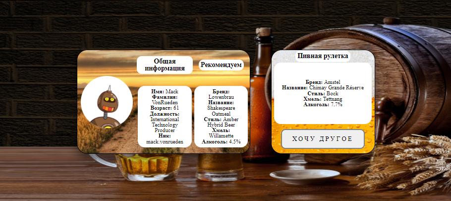

# Пивная рулетка на вечер

Приложение выбирает вам аватара и предлагает пиво на вечер, но так-же есть пивная рулетка рандомного пива, если вы уже пробовали или не хотите предлагаемый вариант можете сменить предлогаемое пиво на другое.

## Устройтсва

Для большенства устройств адаптировано

1. Для настольных компьютеров и ноутбуков

  

2. Для планшетов

  

3. Для смартфонов в горизонтальном и вертикальных положениях

  
  

## Хостинг

Данное приложение задеплоено по ссылке: `https://beer-roulette.herokuapp.com`

## Установка и запуск на локальной машине

- Скопировать репозиторий себе на компьютер;
- Установить зависимости в папке `client` командой `npm i`;
- Запустить приложение через терминал в папке `client` командой `npm run serve`;
- Перейти в браузере по адресу `http://localhost:8080`;
- Готово!
